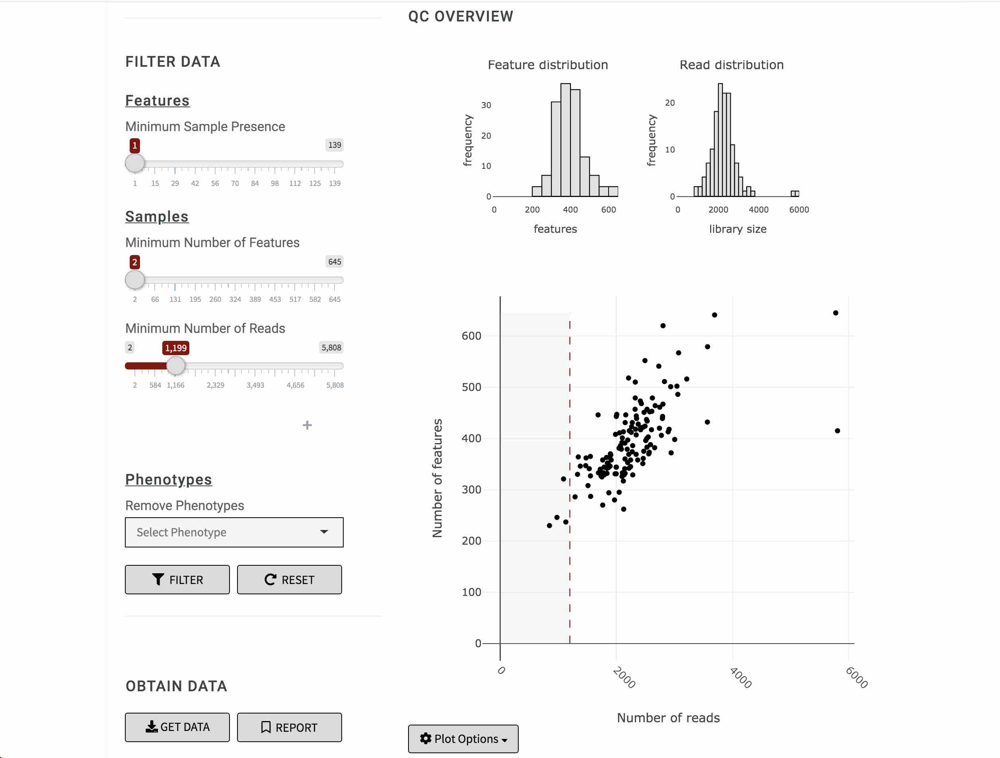
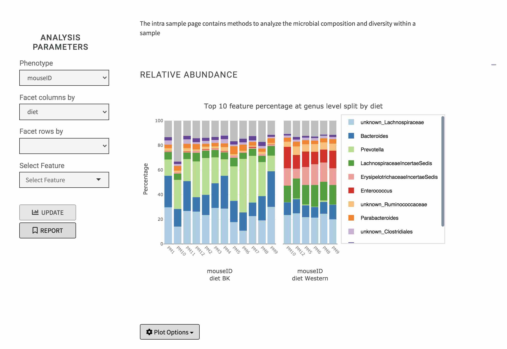
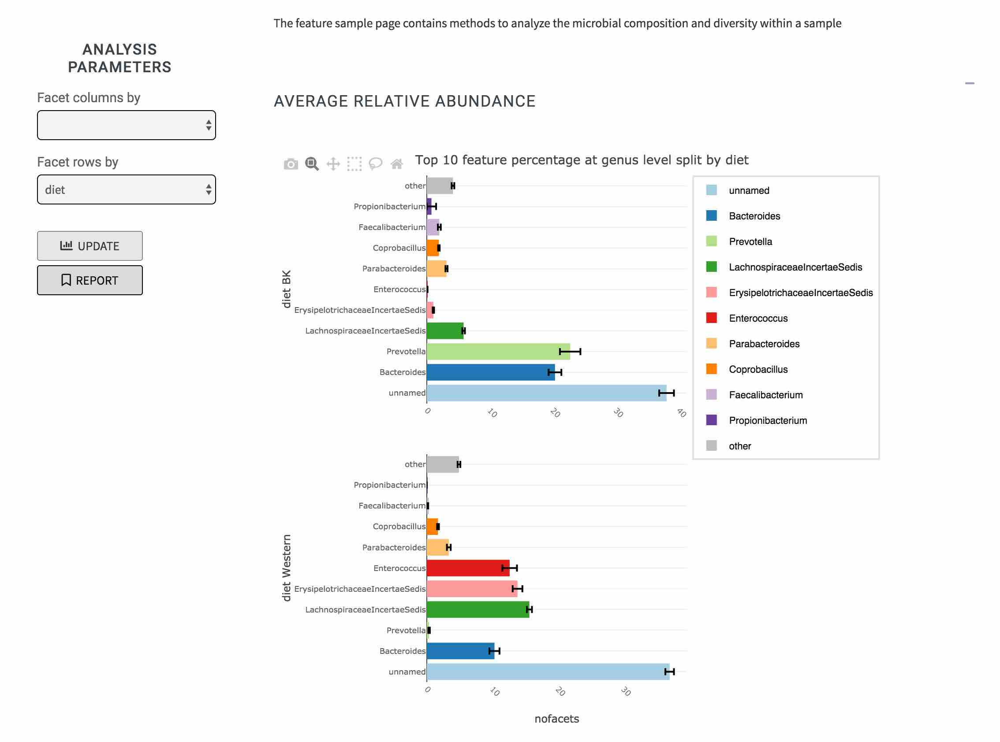
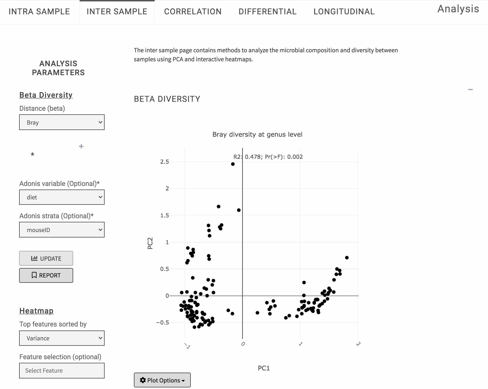
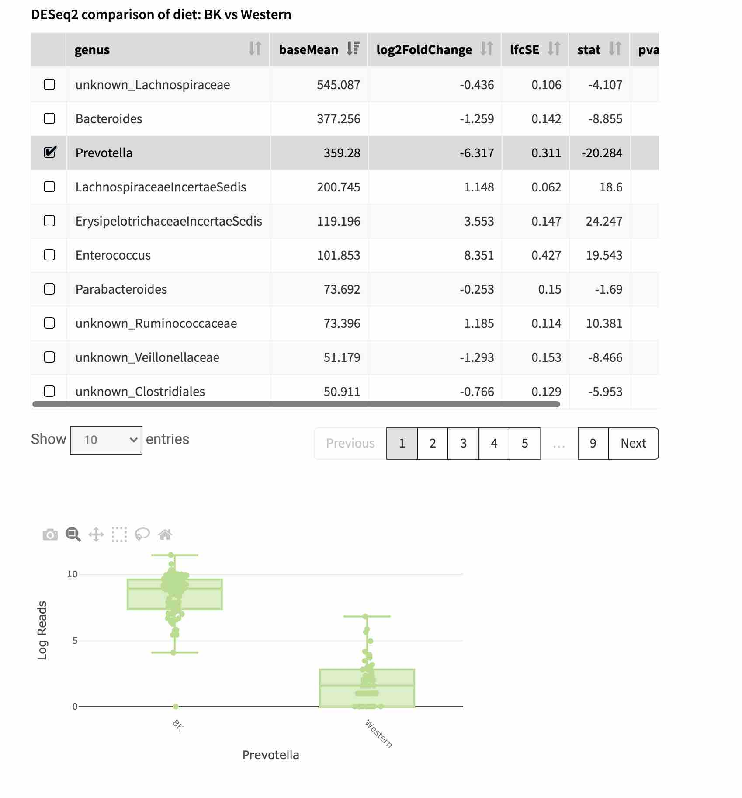
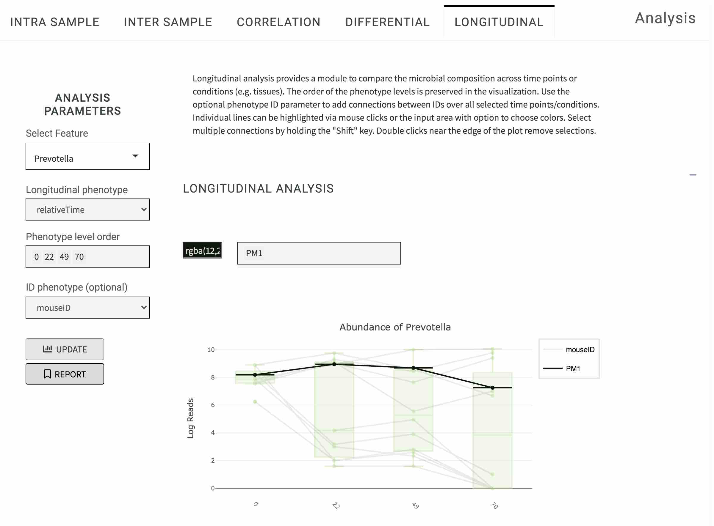
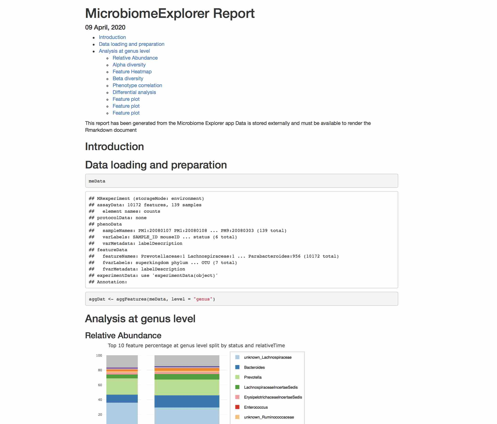

# Microbiome Explorer 
## An R package for the analysis and visualization of microbial communities.

## To install and run Shiny app:

```r
BiocManager::install("zoecastillo/microbiomeExplorer", 
                         ref = "master")
                         
```

## Introduction

The microbiomeExplorer package and the Shiny application contained with it provides methods
and visualizations to explore the results of 16S rRNA amplicon sequencing experiment. The analyses can be performed entirely via the R command line, but the primary intent of the package is to enable access to many of these analyses to non-computational users through the Shiny user interface. 

The interface is launched through the R environment by calling `MicrobiomeExplorerApp()` after loading the package or made available via deployment on a Shiny server. This document is intended to give an introduction of how to use the Shiny application with the addition of R code chunks that a command line user would use to produce the same results.

```r                     
library(microbiomeExplorer)
runMicrobiomeExplorer()
```

## Data upload

#### Microbiome Explorer accepts several different data upload formats

* MRexperiment-class objects stored as RDATA or RDS files
* The Biological Observation Matrix (BIOM) formattes files produced by any program including qiime2 or mothur
* Raw counts files

For further details, please refer to the package vignette.


#### Accessing example data via `metagenomeSeq`

The mouseData example data set is included with the `metagenomeSeq` package on which `microbiomeExplorer` depends. The easiest way to make this data available for the application is to store it as an RDS object on your file system. Then, you can open it via the "Browse" button under *Upload Feature Count Data*.

```r
data("mouseData", package = "metagenomeSeq")
```

## Data QC

Before starting an analysis, it is recommend to review the results of the sequencing experiment and perform quality control. Multiple QC plots can be generated, including those showing the number of unique features in each sample as a barplot or in a scatterplot against the number of reads.



## Analysis

The analysis workflow within the application is split into six different sections: intra sample, intra feature, inter sample, correlation, differential and longitudinal. All visualizations are implemented using the plotly R package which provides basic interactivity, including zooming or panning via its modebar. In addition, the user can export the plot in its current state (i.e. showing specific user interactions) as a svg file using the camera icon of the modebar.

### Intra-Sample Analysis

Intra-sample analysis contains functions focus on investigating the microbial composition within a sample or a group of samples.
Relative abundance shows the most abundant feature in a barplot summarized by a user-defined variable across the x-asis. The feature abundance plot shows the individual abundance of a specific feature either as a boxplot or a categorical scatterplot depending on the x-axis variable chosen. Alpha diversity is a measure of the complexity or diversity within a particular sample, eg. habitat or area. Alpha diversity is computed by functions in the vegan package and is visualized as a boxplot using the same input definitions by feature and relative abundance.



### Intra-Feature Analysis

Intra-feature analysis provides a different view on the feature prevalence in the dataset by showing the average abundance for each feature with added error bars indicating the standard deviation across all of the samples in a particular group.




### Inter-Sample Analysis

Inter-sample analyses focus on differences between samples or groups of samples via feature heatmaps and beta diversity calculations.



### Correlation

Correlation allows the user to visualize the relationship between either two features or a feature and a numeric phenotype in a scatterplot enhanced with a linear regression statistic.


### Differential abundance

Differential abundance (DA) analysis is focused on testing the null hypothesis that the mean or mean ranks between groups are the same for a specific feature. DA analysis can help detect changes in feature abundance across two or more different levels of a phenotype. Four different methods can be chosen via the application: DESeq2, Kruskal-Wallis, limma, or a zero-inflated log normal model.



### Longitudinal

Longitudinal analysis allows the user to generate feature plots with more control over the data shown within the plot. For a specific feature, the user can choose a phenotype and specific levels of that phenotype to show in the plot. The chosen order of the levels will be kept within the visualization which allows sorting by specific dates or tissues among other things.



## Reports

Once an analysis is complete, a user might like to share the results with collaborators or download them for further analysis beyond the functionality provided via the Microbiome Explorer. To do this, we are providing the option to include any part of the analysis in a report which is fully reproducible outside of the application. 

